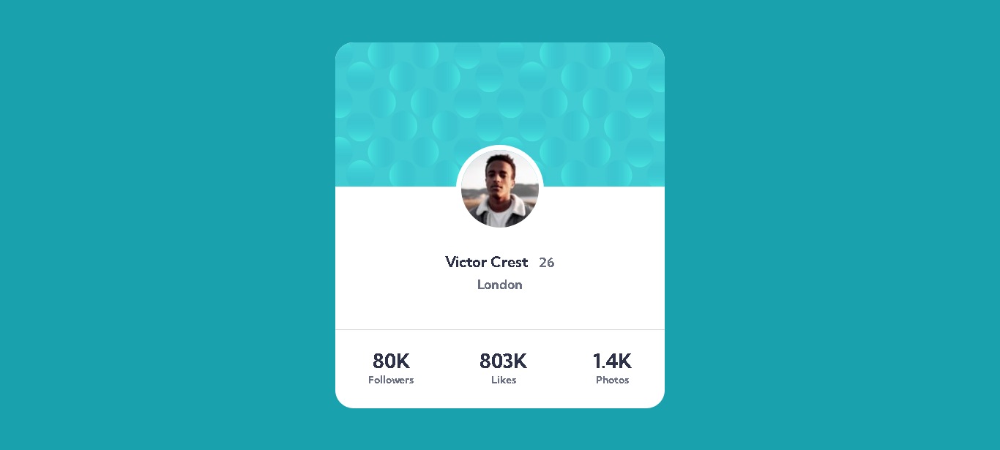

# Frontend Mentor - Profile card component solution

This is a solution to the [Profile card component challenge on Frontend Mentor](https://www.frontendmentor.io/challenges/profile-card-component-cfArpWshJ). Frontend Mentor challenges help you improve your coding skills by building realistic projects. 

## Table of contents

  - [Overview](#overview)
  - [The challenge](#the-challenge)
  - [Links](#links)
  - [Built with](#built-with)
  - [Continued development](#continued-development)
  - [Useful resources](#useful-resources)
  - [Author](#author)

## Overview

### The challenge

- Build out the project to the designs provided

### Links

- Solution URL: [https://github.com/AndreiM987/Profile-card-component.git](https://your-solution-url.com)
- Live Site URL: [https://andreim987.github.io/Profile-card-component/](https://your-live-site-url.com)

### Built with

- Semantic HTML5 markup
- CSS custom properties
- Flexbox
- Mobile-first workflow

### Continued development

Improve my Flexbox skills and css overall.

### Useful resources

- [Flexbox](https://css-tricks.com/snippets/css/a-guide-to-flexbox/) - This is an amazing article which helped me  understand Flexbox. I'd recommend it to anyone still learning this concept.

## Author

- Website - [Andrei Minciuna]
- Frontend Mentor - [@AndreiM987](https://www.frontendmentor.io/profile/yourusername)
